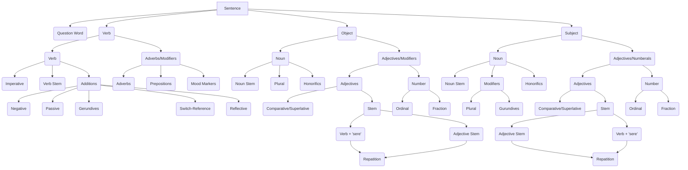

# Ti-iwo-Syntax-Tree
Ti'iwo Syntax Tree

```mermaid
flowchart TD
    Sen[Sentence] 
    Sen--> QW(Question Word)
    Sen--> Vb(Verb)
    Sen--> Ob(Object)
    Sen--> Sb(Subject)
    Vb--> Verb(Verb)
    Vb--> AdM(Adverbs/Modifiers)
    Verb--> Im(Imperative)
    Verb--> VbSt(Verb Stem)
    Verb--> VbAd(Additions)
    VbAd--> NgVb(Negative)
    VbAd--> PaVb(Passive)
    VbAd--> GeVB(Gerundives)
    VbAd--> SRVb(Switch-Reference)
    VbAd--> ReVb(Reflective)
    AdM--> Adv(Adverbs)
    AdM--> Prep(Prepositions)
    AdM--> MM(Mood Markers)
    Ob--> ObN(Noun)
    ObN--> ObSt(Noun Stem)
    ObN--> ObPl(Plural)
    ObN--> ObHo(Honorifics)
    Ob--> ObM(Adjectives/Modifiers)
    ObM--> ObAd(Adjectives)
    ObAd--> ObSC(Comparative/Superlative)
    ObAd--> ObASt(Stem)
    ObASt--> ObVSt("Verb + 'sere'")
    ObASt--> ObAdSt(Adjective Stem)
    ObVSt & ObAdSt--> ObRe(Repatition)
    ObM--> ObNum(Number)
    ObNum--> ObOrd(Ordinal)
    ObNum--> ObFra(Fraction)
    Sb--> SbN(Noun)
    SbN--> SbSt(Noun Stem)
    SbN--> SbNM(Modifiers)
    SbNM--> SbPl(Plural)
    SbNM--> SbGer(Gurundives)
    SbN--> SbHo(Honorifics)
    Sb--> SbAdN(Adjectives/Numberals)
    SbAdN--> SbAd(Adjectives)
    SbAd--> SbSC(Comparative/Superlative)
    SbAd--> SbAdSt(Stem)
    SbAdSt--> SbAdjSt(Adjective Stem)
    SbAdSt--> SbAdVb("Verb + 'sere'")
    SbAdjSt & SbAdVb--> SbAdRe(Repatition)
    SbAdN--> SbNum(Number)
    SbNum--> SbOrd(Ordinal)
    SbNum--> SbFra(Fraction)

```
